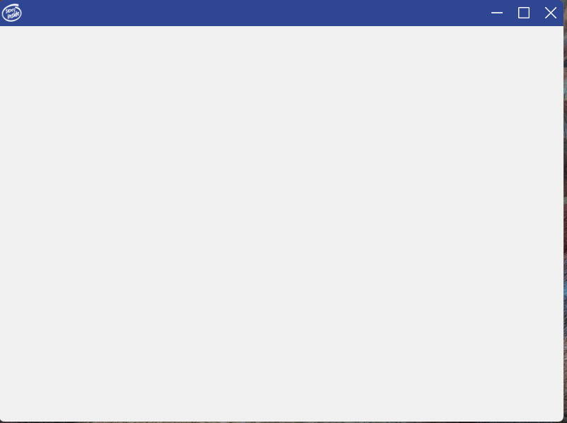

# 简介
一款基于Qt/QWidget的无边框窗口框架，支持拖拽，缩放，阴影，桌面吸附等特性。

# 功能

* Win11圆角/Win10直角边框自动适配
* 多显示器且不同dpi下表现接近完美
* 支持aero阴影
* 自定义标题栏按钮
* 最大/还原按钮图片能自动切换
* Win快捷键+上下左右吸附
* Win快捷键+左右可跨屏移动
* 标题栏按钮悬浮/点击/弹起时有不同效果
* 上下左右边框可鼠标拉伸
* 最大化状态下拖拽标题栏可以还原窗口
* 通过qss文件定义标题按钮，方便替换

# 演示

